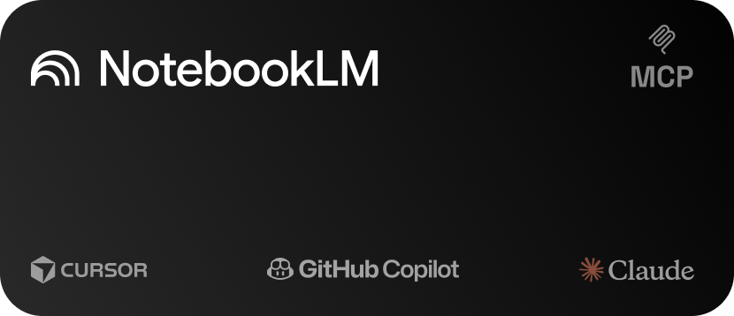

[](https://github.com/julianoczkowski/notebooklm-mcp-2026/actions/workflows/ci.yml)
[](https://modelcontextprotocol.io)
[](https://notebooklm.google.com)
[](https://python.org)
[](https://github.com/jlowin/fastmcp)
[](https://pypi.org/project/notebooklm-mcp-2026/)
[](LICENSE)



# notebooklm-mcp-2026

Secure MCP server for querying Google NotebookLM notebooks. Designed for use with Claude Code, Cursor, VS Code Copilot, and any MCP-compatible AI assistant.

## What it does

notebooklm-mcp-2026 gives AI assistants direct access to your Google NotebookLM notebooks. It runs as a local subprocess (stdio transport) — no HTTP server needed. Your AI assistant can list your notebooks, read source content, and ask the NotebookLM AI questions about your sources.

<p align="center">
  
</p>

## Quick Start

Three commands. Works on macOS, Linux, and Windows.

### Step 1: Install

**macOS / Linux:**

```bash
curl -LsSf https://astral.sh/uv/install.sh | sh
uv tool install notebooklm-mcp-2026
```

**Windows (PowerShell):**

```powershell
powershell -ExecutionPolicy ByPass -c "irm https://astral.sh/uv/install.ps1 | iex"
uv tool install notebooklm-mcp-2026
```

> **Already have pipx?** You can use `pipx install notebooklm-mcp-2026` instead.

### Step 2: Set up

> **Important:** Close Google Chrome completely before running setup. The login process needs to launch Chrome with special flags, which won't work if Chrome is already running.

```bash
notebooklm-mcp-2026 setup
```

This will:

1. Open Chrome so you can log in to your Google account
2. Detect which MCP clients you have installed (Claude Code, Cursor, VS Code, etc.)
3. Automatically configure them

### Step 3: Use it

Restart your MCP client and ask your AI assistant:

> "List my NotebookLM notebooks"

That's it!

## Requirements

- **Google Chrome** (or Chromium) — needed for one-time login
- **Python 3.11+** — installed automatically if you use `uv`

### Don't have Chrome?

Download it from [google.com/chrome](https://www.google.com/chrome/). On Linux, `chromium` also works.

### Don't have Python?

If you used `uv` to install (recommended), you don't need to install Python separately — `uv` handles it for you.

If you prefer to install Python manually:

| Platform        | Command                                                                                |
| --------------- | -------------------------------------------------------------------------------------- |
| macOS           | `brew install python`                                                                  |
| Ubuntu / Debian | `sudo apt install python3`                                                             |
| Arch / Manjaro  | `sudo pacman -S python`                                                                |
| Fedora          | `sudo dnf install python3`                                                             |
| Windows         | Download from [python.org](https://python.org) — tick **"Add to PATH"** during install |

## Alternative Install Methods

The Quick Start uses `uv` because it's the simplest (single binary, no Python version conflicts). Other options:

```bash
# pipx (if you already have it)
pipx install notebooklm-mcp-2026

# pip (inside a virtual environment)
python -m venv .venv && source .venv/bin/activate
pip install notebooklm-mcp-2026

# From source
git clone https://github.com/julianoczkowski/notebooklm-mcp-2026.git
cd notebooklm-mcp-2026
pip install -e .
```

## Authentication

notebooklm-mcp-2026 uses Google session cookies extracted via Chrome DevTools Protocol. No passwords are stored — only session cookies.

> **Important:** Close Google Chrome completely before running login. The login process needs to launch Chrome with special debugging flags, which won't work if Chrome is already running.

```bash
notebooklm-mcp-2026 login
```

This opens Chrome, you log in to Google, and the tool saves the session cookies locally. Cookies last 2–4 weeks. When they expire, run `login` again.

If Chrome can't be found automatically, the tool will show you the exact command to launch Chrome manually, or you can specify the path:

```bash
notebooklm-mcp-2026 login --chrome-path "/path/to/chrome"
```

### Where credentials are stored

| Platform | Location                                                      |
| -------- | ------------------------------------------------------------- |
| Linux    | `~/.local/share/notebooklm-mcp-2026/auth.json`                |
| macOS    | `~/Library/Application Support/notebooklm-mcp-2026/auth.json` |
| Windows  | `%LOCALAPPDATA%\notebooklm-mcp-2026\auth.json`                |

Override with: `NOTEBOOKLM_MCP_DATA_DIR=/custom/path`

## CLI Commands

| Command                       | Description                                                             |
| ----------------------------- | ----------------------------------------------------------------------- |
| `notebooklm-mcp-2026 setup`   | Interactive setup wizard — authenticates and configures your MCP client |
| `notebooklm-mcp-2026 login`   | Authenticate via Chrome (opens browser window)                          |
| `notebooklm-mcp-2026 logout`  | Remove stored credentials and start fresh                               |
| `notebooklm-mcp-2026 serve`   | Start the MCP server over stdio (used by MCP clients)                   |
| `notebooklm-mcp-2026 status`  | Show authentication and MCP client configuration status                 |
| `notebooklm-mcp-2026 doctor`  | Diagnose common issues (Chrome, auth, permissions)                      |
| `notebooklm-mcp-2026 version` | Print version                                                           |

## MCP Client Configuration

The `setup` command auto-configures your MCP client. You should not need to edit these files manually, but if you do:

<details>
<summary>Claude Code — <code>~/.claude.json</code></summary>

```json
{
  "mcpServers": {
    "notebooklm-mcp-2026": {
      "command": "notebooklm-mcp-2026",
      "args": ["serve"]
    }
  }
}
```

</details>

<details>
<summary>Cursor — <code>~/.cursor/mcp.json</code></summary>

```json
{
  "mcpServers": {
    "notebooklm-mcp-2026": {
      "command": "notebooklm-mcp-2026",
      "args": ["serve"]
    }
  }
}
```

</details>

<details>
<summary>VS Code (Copilot) — <code>mcp.json</code></summary>

```json
{
  "servers": {
    "notebooklm-mcp-2026": {
      "command": "notebooklm-mcp-2026",
      "args": ["serve"]
    }
  }
}
```

</details>

<details>
<summary>Claude Desktop</summary>

Claude Desktop does not inherit your terminal's PATH, so you **must use the full path** to the executable.

First, find your executable path:

```bash
# macOS / Linux
which notebooklm-mcp-2026

# Windows (PowerShell)
where notebooklm-mcp-2026
```

Then edit your config file:

- **macOS:** `~/Library/Application Support/Claude/claude_desktop_config.json`
- **Windows:** `%APPDATA%\Claude\claude_desktop_config.json`

**macOS example:**

```json
{
  "mcpServers": {
    "notebooklm-mcp-2026": {
      "command": "/Users/YOUR_USER/.local/bin/notebooklm-mcp-2026",
      "args": ["serve"]
    }
  }
}
```

**Windows example:**

```json
{
  "mcpServers": {
    "notebooklm-mcp-2026": {
      "command": "C:\\Users\\YOUR_USER\\.local\\bin\\notebooklm-mcp-2026.exe",
      "args": ["serve"]
    }
  }
}
```

Replace `YOUR_USER` with your actual username, or paste the exact path from the `which`/`where` command above.

</details>

## Available Tools (9)

| Tool                 | Description                          | Key Parameters                                            |
| -------------------- | ------------------------------------ | --------------------------------------------------------- |
| `login`              | Launch Chrome for Google OAuth login | `timeout` (default: 300s)                                 |
| `check_auth`         | Verify stored credentials are valid  | —                                                         |
| `list_notebooks`     | List all notebooks with metadata     | `max_results` (default: 50)                               |
| `get_notebook`       | Get notebook details + source list   | `notebook_id`                                             |
| `list_sources`       | List sources in a notebook           | `notebook_id`                                             |
| `get_source_content` | Get full text of a source            | `source_id`                                               |
| `query_notebook`     | Ask the AI a question                | `notebook_id`, `query`, `source_ids?`, `conversation_id?` |
| `add_source_url`     | Add a URL/YouTube source             | `notebook_id`, `url`                                      |
| `add_source_text`    | Add pasted text source               | `notebook_id`, `text`, `title?`                           |

### Typical workflow

```
1. list_notebooks          → find the notebook ID you want
2. list_sources            → see what sources are in it
3. query_notebook          → ask questions about the sources
4. get_source_content      → read raw source text if needed
```

### Example output

When your AI assistant calls `list_notebooks`, it gets back structured data like this:

```json
{
  "status": "success",
  "count": 2,
  "notebooks": [
    {
      "id": "abc123-def456",
      "title": "Research Notes",
      "source_count": 3,
      "is_owned": true,
      "modified_at": "2026-01-15T10:30:00+00:00"
    },
    {
      "id": "ghi789-jkl012",
      "title": "Project Planning",
      "source_count": 5,
      "is_owned": true,
      "modified_at": "2026-01-14T08:00:00+00:00"
    }
  ]
}
```

And `query_notebook` returns:

```json
{
  "status": "success",
  "answer": "Based on the sources, the main topics covered are...",
  "conversation_id": "conv-uuid-123",
  "turn_number": 1,
  "is_follow_up": false
}
```

### Follow-up conversations

`query_notebook` returns a `conversation_id`. Pass it back to ask follow-up questions in the same conversation context:

```
# First question
result = query_notebook(notebook_id="abc", query="What is the main topic?")
# result.conversation_id = "uuid-123"

# Follow-up
result = query_notebook(notebook_id="abc", query="Tell me more about that", conversation_id="uuid-123")
```

## Troubleshooting

### "Not authenticated" error

Run `notebooklm-mcp-2026 login` in your terminal.

### "Cookies expired" error

Session cookies have a limited lifespan (2–4 weeks). Run `notebooklm-mcp-2026 login` again.

### "Chrome not found" error

Install Google Chrome or Chromium. On Linux, ensure `google-chrome` or `chromium` is in your PATH. You can also specify the path directly:

```bash
notebooklm-mcp-2026 login --chrome-path "/path/to/chrome"
```

### Empty notebook list

Make sure you're logged into the correct Google account that has NotebookLM notebooks.

### "Build label" errors

Google occasionally rotates their build label. Set the updated label:

```bash
NOTEBOOKLM_BL="boq_labs-tailwind-frontend_YYYYMMDD.XX_p0" notebooklm-mcp-2026 serve
```

### Rate limit errors

NotebookLM free tier allows ~50 queries per day. Wait until the next day or upgrade.

### Something else?

Run the diagnostic tool:

```bash
notebooklm-mcp-2026 doctor
```

## Environment Variables

| Variable                   | Default                                     | Description                    |
| -------------------------- | ------------------------------------------- | ------------------------------ |
| `NOTEBOOKLM_MCP_DATA_DIR`  | Platform default                            | Override data storage location |
| `NOTEBOOKLM_BL`            | `boq_labs-tailwind-frontend_20260108.06_p0` | Google build label             |
| `NOTEBOOKLM_QUERY_TIMEOUT` | `120.0`                                     | Query timeout in seconds       |

## Security

- **No passwords stored** — only Google session cookies
- **File permissions** — credentials saved with `0o600` (owner read/write only)
- **Directory permissions** — data directory created with `0o700` (owner only)
- **No `eval`/`exec`** — no dynamic code execution anywhere
- **No `shell=True`** — Chrome launched with explicit argument lists
- **Cookie filtering** — only essential Google auth cookies are persisted
- **Chrome cleanup** — Chrome process always terminated in `finally` blocks
- **Input validation** — all tool parameters validated before use
- **Timeouts** — all HTTP requests have explicit timeouts
- **CSRF protection** — tokens passed in request body, auto-refreshed on expiry

## Development

```bash
# Install dev dependencies
pip install -e ".[dev]"

# Run tests
pytest

# Lint
ruff check src/ tests/
```

### Testing with MCP Inspector

The [MCP Inspector](https://modelcontextprotocol.io/docs/tools/inspector) lets you interactively test the server's tools in a web UI:

```bash
npx @modelcontextprotocol/inspector notebooklm-mcp-2026 serve
```

This opens a browser where you can call each of the 9 tools with custom parameters and inspect responses. You must run `notebooklm-mcp-2026 login` first.

## Getting Help

- **Questions?** Start a [Discussion](https://github.com/julianoczkowski/notebooklm-mcp-2026/discussions)
- **Found a bug?** Open an [Issue](https://github.com/julianoczkowski/notebooklm-mcp-2026/issues)
- **Want to contribute?** See [CONTRIBUTING.md](CONTRIBUTING.md)
- **Security issue?** See [SECURITY.md](SECURITY.md) for responsible disclosure

## License

MIT
